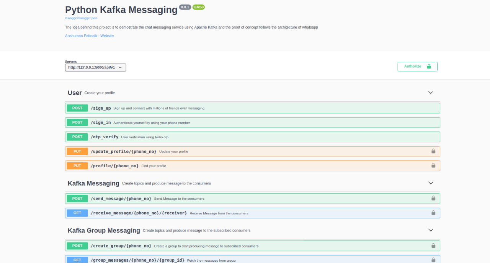

## Python Kafka Messaging
The idea behind this project is to demonstrate the chat messaging service using [Apache Kafka](https://kafka.apache.org/) and this proof of concept follows the architecture of WhatsApp messaging, (i.e. one to one messaging and group messaging). Apache Kafka messaging framework works based on producer and consumer architecture and to implement these core concepts it provides us to create Kafka topics, send messages using KafkaProducer and receive messages using KafkaConsumer based on the subscribed topics, so the Kafka framework is quite helpful while building distributed streaming-based system.


## Technical Overview
The proof of concept written using python and it follows the core & common architecture of WhatsApp Messenger and to replicate the similar messaging concepts it uses [kafka-python](https://pypi.org/project/kafka-python/) library to send/receive messages using KafkaProducer/KafkaConsumer. It also implements [Twilio](https://www.twilio.com/) messaging framework for user authentication by verifying their registered phone no using the sent OTP and to cache all the user data and chat messages it uses mongodb database for the storage.

In this messaging system, there are three different types of Microservices designed using [python flask framework](https://flask.palletsprojects.com/en/1.1.x/).

1. Users
2. Kafka Messaging
3. Kafka Group Messaging

To run the complete project, first of all, you need to install Kafka in your local system, I have installed [kafka_2.12-2.6.0](https://kafka.apache.org/downloads) latest version in my ubuntu-18.04 machine.

### Swagger API Documentation
The Swagger API docs can be accessible via [http://127.0.0.1:5000/api/docs](http://127.0.0.1:5000/api/docs) and to test the API endpoints you need to authorize yourself using your jwt access token.



## Installation
``````````````````````````````````````````````````````````````````
git clone https://github.com/anshumanpattnaik/python-kafka-messaging
cd python-kafka-messaging
pip install -r requirements.txt
``````````````````````````````````````````````````````````````````

## Twilio Configurations
To run the Twilio messaging framework, first of all, you need to sign up an account in [Twilio developer console](https://www.twilio.com/console) and once you have the credentials then follow the below steps to configure the environment variables for secret keys.

```````````````````````````````````````````````````````````````````
$ nano ~/.bash_profile

// Add the below variables to your profile
export ACCOUNT_SID='TWILIO_ACCOUNT_SID'
export AUTH_TOKEN='TWILIO_AUTH_TOKEN'
export TWILIO_PHONE_NO='TWILIO_SENDER_PHONE_NO'

$ source ~/.bash_profile
```````````````````````````````````````````````````````````````````

## Start Kafka Server
When you have Kafka set up in your local machine before starting the project first you need to start Kafka server in your localhost.

### Execute the below command in terminal-1
``````````````````````````````````````````````````````````````
$ cd kafka_2.12-2.6.0
$ bin/kafka-server-start.sh config/server.properties
``````````````````````````````````````````````````````````````

### Start the python kafka project in terminal-2
``````````````````````````````````````````````````````````````
$ cd python-kafka-messaging
$ source venv/bin/activate
$ python3 run.py

Open http://127.0.0.1:5000 to view in the browser.
``````````````````````````````````````````````````````````````

### Start the python kafka consumer script in terminal-3
Once your Kafka server up and running then go inside the project and start the [kafka-consumer.py](https://github.com/anshumanpattnaik/python-kafka-messaging/blob/main/kafka_consumer.py) script to receive an incoming message from the producer.

#### Important
In case of one to one messaging you can comment out `subscribe` code at line no [21](https://github.com/anshumanpattnaik/python-kafka-messaging/blob/b651fbbdd34650408a6ae639b7ce1a536e0d121e/kafka_consumer.py#L21) because it's only required in a group conversation.

````````````````````````````````````````
# consumer.subscribe(group_topic) // in case of one to one conversation
````````````````````````````````````````

`````````````````````````````````````````````````````````````````
$ cd python-kafka-messaging
$ python3 kafka_consumer.py -p YOUR_PARTICIPANT_PHONE_NO
`````````````````````````````````````````````````````````````````

#### Note
It's quite important to understand basic Kafka concepts (i.e Topics/Producer/Consumer) so I'll highly recommend [kafka official documentation](https://kafka.apache.org/intro) to understand the Kafka architecture in depth.

### License
This project is licensed under the [MIT License](LICENSE)
